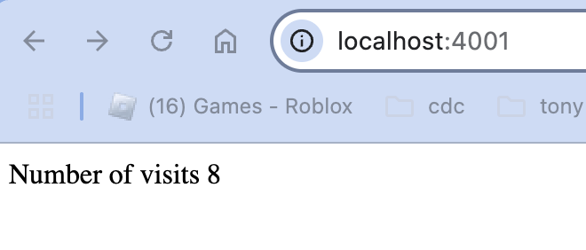

# node-redis-docker-compose example
#### (An example app that uses )
#### Source
1. borrowed from [Stephen Grider's Udemy Course - Docker and Kubernetes: The Complete Guide - Lesson 54](https://www.udemy.com/course/docker-and-kubernetes-the-complete-guide/learn/lecture/11436998#overview)
2. borrowed from [Docker Compose QuickStart](https://docs.docker.com/compose/gettingstarted/)

### Run instructions

1. Start docker desktop.
2. Use docker compose to create the network and containerized services;
```bash
docker compose -f docker-compose.yml up -d
```
3. Exercise the app
  - Visit the url http://localhost:4001
  - You should see the following screenshot<br/>
    